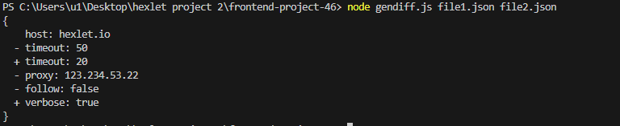

### Hexlet tests and linter status:
      

Требования: Node.js v20.1.0 и выше

Установка: Склонируйте репозиторий, выполнив команду git clone "ссылка на нужный репозиторий" Установите зависимости ,выполнив команду npm i

genDiff

Сравнивание json файлов

